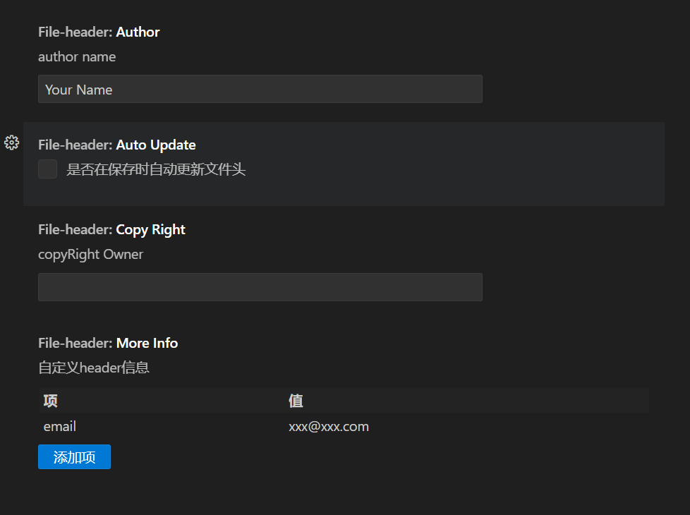

# file-header

这个插件提供超级简单的文件头注释功能，支持多种语言。维护 ing

## Features

**without json!!!**
**without json!!!**
**without json!!!**

---

- 支持添加文件头注释: `ctrl+alt+h`
- 支持更新文件头注释: `ctrl+alt+u`
- 需要其他功能的话，可以提 issue

### 支持语言

有其他语言需要支持的话，可以提 issue，附上模板。

- JavaScript/JSX
- TypeScript/TSX
- Java
- C/C++
- C#
- PHP
- Rust
- go
- Python

## Extension Settings

